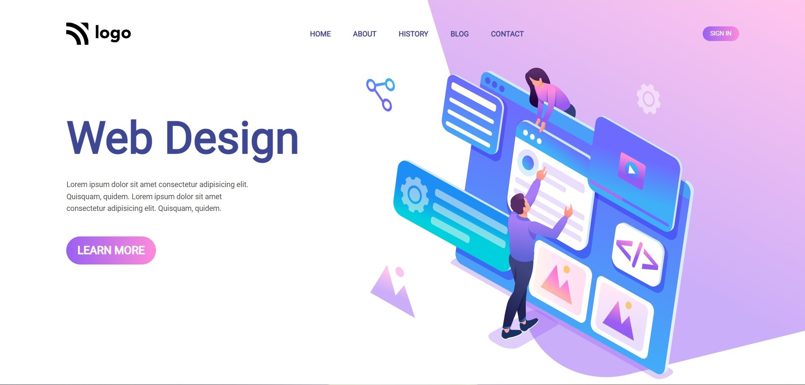

# Project 8 - HTML  and CSS 

By Shubham

Here's the Live Deployed Website 

## [DEPLOYED WEBSITE LINK](https://ineurondesign.netlify.app/)

## What I learned from this Project?

- I learned about **layout** making through **Flexbox**.
- I also learned how to use **Illustrations**.
- I also learned how to design **Beautiful Buttons with Gredient**.
- I also learned how to **Position Elements**.

## This project took around **4 hours** to complete.
